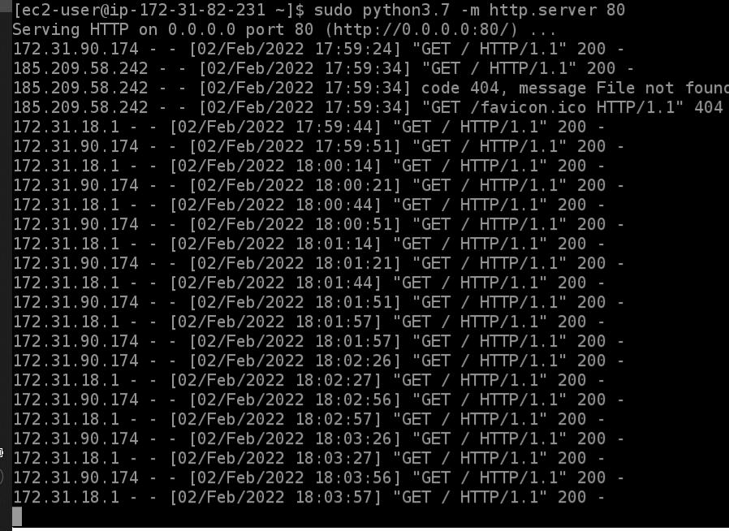

# highload-sw-arch-hw-24

## 1. Set up 2 EC2 instances

## 2. Set up inbound rule for HTTP 80 port

## 3. Launched python server on port 80 on 1 instance

## 4. Created load balancer with 2 assigned instances and checked that 1 instance is down and 1 is up

